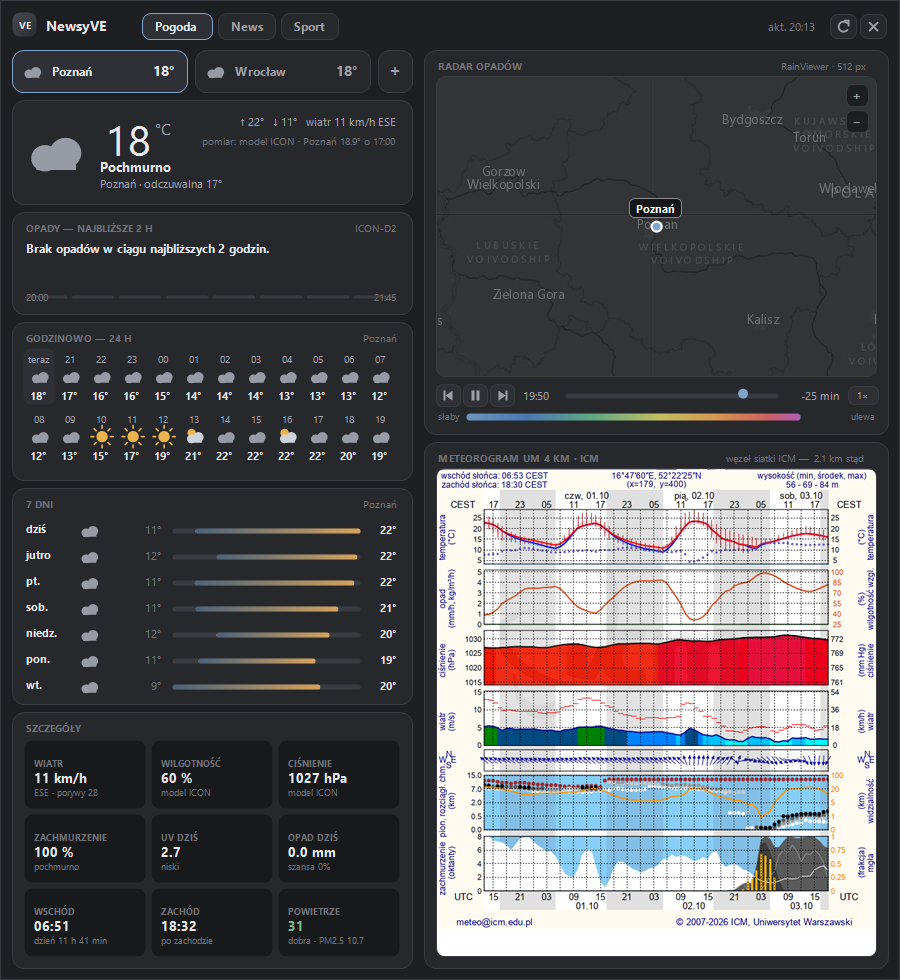
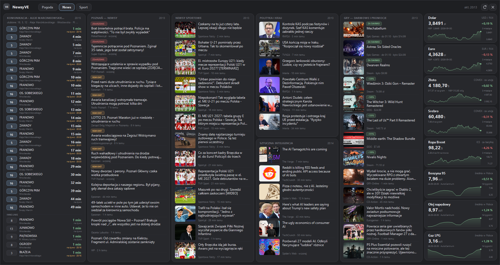
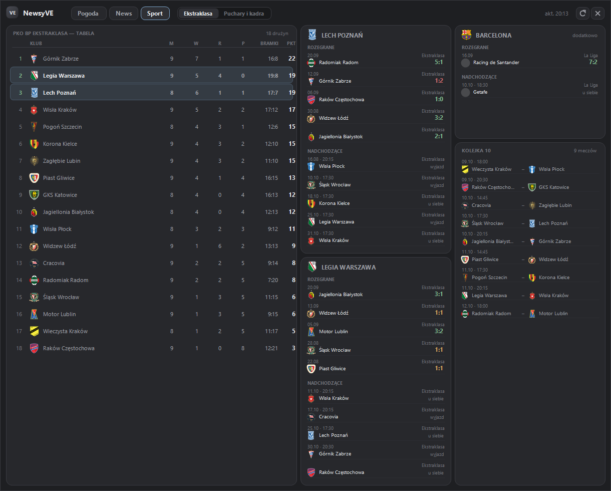
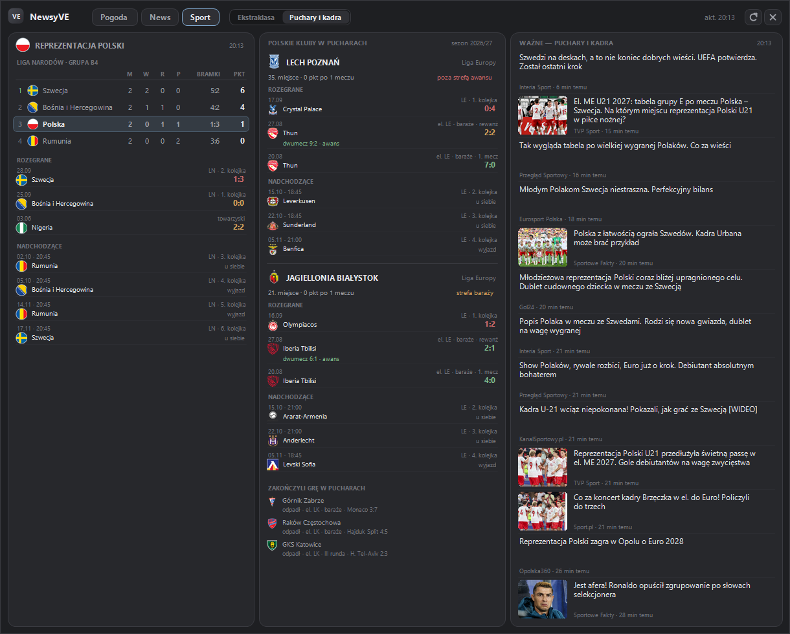
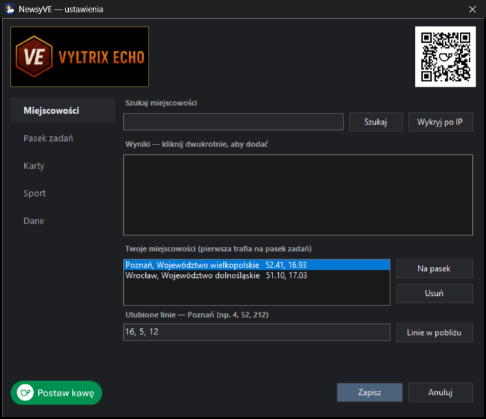
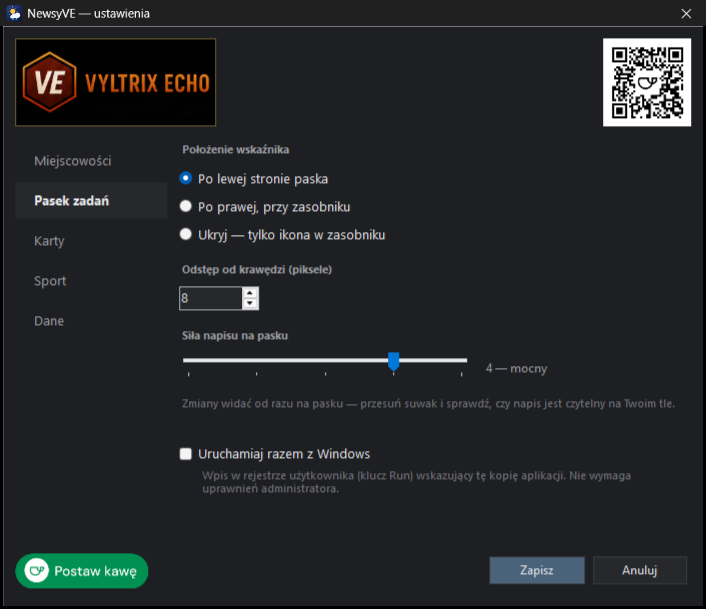
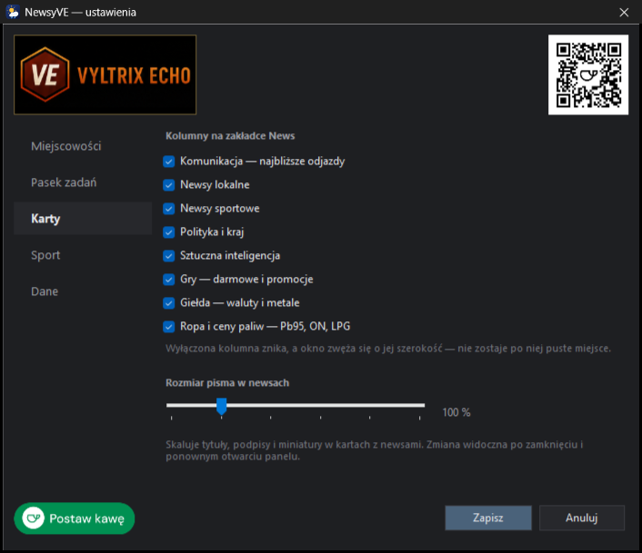
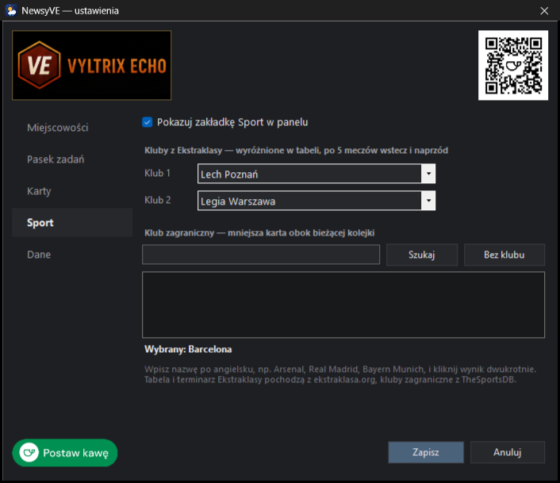
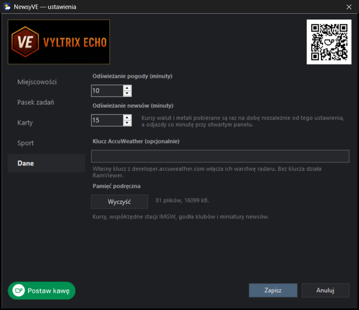

# NewsyVE — pogoda, newsy i sport na pasku zadań

**NewsyVE** to natywna aplikacja Windows od **VyltrixEcho**: pogoda wrysowana
wprost w pasek zadań, a po kliknięciu panel z radarem, meteorogramem, newsami,
kursami, odjazdami komunikacji i piłką nożną.

- **jeden proces**, ok. 290 kB — bez przeglądarki, bez Electrona, bez PowerShella w tle,
- **bez zależności** — kompiluje się kompilatorem C# wbudowanym w każdy Windows 10/11,
- **bez kluczy API** — wszystkie źródła danych są publiczne,
- **bez uprawnień administratora** — instaluje się do profilu użytkownika,
- motyw grafitowy, interfejs po polsku.



<details>
<summary><b>Więcej zrzutów ekranu</b></summary>

**News** — komunikacja, newsy lokalne, sport, polityka, AI, gry, kursy i paliwa



**Sport** — tabela Ekstraklasy, wybrane kluby, bieżąca kolejka



**Sport → Puchary i kadra** — reprezentacja Polski i polskie kluby w europejskich pucharach



**Ustawienia**

| | |
|---|---|
|  |  |
|  |  |
|  | |

</details>

## Instalacja

Pobierz **`NewsyVE-Setup.exe`** z zakładki
[Releases](../../releases) i uruchom — jeden plik, bez zależności i bez uprawnień
administratora. Aplikacja siedzi w zasobach instalatora.

| opcja instalatora | domyślnie |
|---|---|
| Skrót na pulpicie | tak |
| Uruchamiaj razem z Windows | nie |
| Uruchom po instalacji | tak |

Instaluje do `%LOCALAPPDATA%\NewsyVE` i tworzy wpis w menu Start. Ponowne
uruchomienie instalatora na zainstalowanej kopii pokazuje **Aktualizuj**
(podmienia plik, zachowuje ustawienia) i **Odinstaluj** (usuwa aplikację,
skróty i ustawienia). Działającą kopię instalator zamyka sam.

> Plik nie jest podpisany certyfikatem, więc Windows SmartScreen może przy
> pierwszym uruchomieniu pokazać ostrzeżenie — *Więcej informacji → Uruchom mimo to*.
> Kto woli, może zbudować wszystko sam ze źródeł (niżej).

### Budowanie ze źródeł

```powershell
.\Build-Setup.ps1      # kompiluje aplikację i pakuje ją w instalator
.\Build-NewsyVE.ps1    # sama aplikacja, bez instalatora
```

Oba używają `csc.exe` z .NET Framework 4.8, który jest w każdym Windows 10/11 —
nie trzeba instalować Visual Studio ani .NET SDK.

Jest też `Install-NewsyVE.ps1` (instalacja prosto z katalogu ze źródłami,
przełączniki `-Desktop`, `-Autostart`, `-Rebuild`, `-NoLaunch`) oraz
`Uninstall-NewsyVE.ps1`.

## Jak to wygląda

Aplikacja ma dwa widoki tego samego procesu:

1. **Pasek zadań** — ikona pogody, temperatura i nazwa miejscowości wrysowane
   w pasek (lewa albo prawa strona) plus ikona w zasobniku.
2. **Panel** — trzy zakładki, każda bez przewijania i każda z własną szerokością
   okna, zakotwiczony nad wskaźnikiem pogody:

| zakładka | co zawiera |
|---|---|
| **Pogoda** | przełącznik miejscowości (do trzech), warunki bieżące, opady na 2 h, 24 godziny, 7 dni, 9 kafelków szczegółów · radar opadów z animacją · meteorogram ICM UM 4 km |
| **News** | najbliższe odjazdy komunikacji · newsy lokalne · newsy sportowe · polityka i kraj · sztuczna inteligencja · gry (darmowe i promocje) · kursy USD, EUR, złota, srebra, ropy · ceny paliw |
| **Sport** | podzakładka **Ekstraklasa**: tabela, dwa wybrane kluby, klub zagraniczny, bieżąca kolejka · podzakładka **Puchary i kadra**: reprezentacja Polski, polskie kluby w LM / LE / LK, ważne newsy |

Każdą kolumnę zakładki News można wyłączyć w ustawieniach — okno zwęża się
wtedy o jej szerokość, zamiast zostawiać dziurę.

| akcja | efekt |
|---|---|
| klik w pasek zadań / ikonę zasobnika | pokazuje panel; kolejny klik chowa |
| `Esc`, × albo klik poza panelem | zamyka panel |
| klik w meteorogram | pełna wersja na meteo.pl |
| klik w kurs | ten instrument na TradingView |
| klik w news | artykuł w przeglądarce |
| ⏮ ⏯ ⏭, suwak, `1×` | sterowanie animacją radaru |
| `+` / `−` na mapie | zoom radaru (5–9) |
| prawy klik na pasku | menu: ustawienia, miejscowość, strona paska, siła napisu, linki |

## Ustawienia

Prawy przycisk na pasku → **Ustawienia…**

| strona | co tam jest |
|---|---|
| **Miejscowości** | wyszukiwarka (cały świat, nazwy po polsku), podpowiedź po IP, do trzech miejscowości, która trafia na pasek, ulubione linie komunikacji dla każdej miejscowości |
| **Pasek zadań** | strona paska albo tylko zasobnik, odstęp od krawędzi, siła napisu (1–5), autostart |
| **Karty** | które kolumny pokazuje zakładka News, rozmiar pisma w newsach (90–140 %) |
| **Sport** | włączenie zakładki, dwa kluby z Ekstraklasy, klub zagraniczny (wyszukiwarka TheSportsDB) |
| **Dane** | częstotliwość odświeżania, opcjonalny klucz AccuWeather, czyszczenie pamięci podręcznej |

Przy pierwszym uruchomieniu aplikacja sama otwiera okno miejscowości
z podpowiedzią z geolokalizacji po IP.

**Geolokalizacja po IP jest tylko podpowiedzią.** Adres IP mówi, gdzie operator
ma punkt styku z siecią, a nie gdzie siedzi użytkownik — trzy różne usługi
potrafią dla tego samego łącza wskazać trzy różne miasta oddalone o setki
kilometrów. Dlatego wynik zawsze trzeba potwierdzić.

### Co aplikacja dolicza sama dla każdej miejscowości

| | skąd |
|---|---|
| **punkt siatki ICM** | z odwróconej kalibracji siatki UM 4 km (niżej) |
| **stacja synoptyczna IMGW** | najbliższa z 62 stacji, o ile leży bliżej niż 30 km |
| **województwo** | z regionu zwróconego przez geokoder — do ostrzeżeń IMGW |

Lista stacji IMGW nie zawiera współrzędnych, więc przy pierwszym użyciu stacje
są raz geokodowane i zapisywane do `stacje.cache`; potem dopasowanie jest
natychmiastowe.

Pomiar ze stacji trafia do panelu tylko wtedy, gdy jest świeży (młodszy niż
~100 min). Gdy w promieniu 30 km nie ma stacji, karta pokazuje sam model.

ICM liczy meteorogramy tylko dla części węzłów. Gdy wyliczony węzeł nie ma danych,
sprawdzanych jest osiem sąsiednich, a nagłówek karty mówi, ile kilometrów od
miejscowości leży użyty węzeł.

## Pogoda

### Dlaczego model ICON, a nie „najlepszy dostępny”

Open-Meteo domyślnie dobiera model sam (`best_match`). Dla południowej Polski
potrafiło to dać wynik bezużyteczny: w trakcie deszczu wilgotność **1 %** dla
każdej godziny doby i **zero opadów** na dwie godziny w przód, podczas gdy
najbliższa stacja IMGW raportowała ponad 80 % wilgotności i kilka milimetrów
opadu. Ten sam moment na modelu `icon_seamless` zgadzał się z pomiarem.

Dlatego zapytanie jest przypięte do `models=icon_seamless` (ICON globalny + EU +
D2, siatka 2 km nad Polską). Model pogodowy nie liczy indeksu UV, więc ten
pochodzi z CAMS — z tego samego zapytania, które pobiera jakość powietrza.

Wszystkie wybrane miejscowości pobierane są **jednym** zapytaniem — Open-Meteo
przyjmuje listę współrzędnych. Gdy pobranie się nie uda, aplikacja ponawia po
10, 20, 30… sekundach (maksymalnie co minutę, do ośmiu prób), zamiast czekać
pełnych 10 minut.

### Radar

Mapa składana jest z kafli w samej aplikacji: podkład **Esri Dark Gray**
przyciemniony do poziomu motywu, na to warstwa opadów **RainViewer**.
Kafle 512 px rysowane w 256 px — obraz jest nadpróbkowany, a nie rozmyty.
Powyżej natywnego zasięgu RainViewera (zoom 7) kafle są skalowane.
Klatki (przeszłe + prognoza) pobierane są z wyprzedzeniem w tle, więc animacja
nie przycina.

**AccuWeather** serwuje własną warstwę radaru, ale wymaga klucza API. Klucz
zaszyty w ich stronie jest ich własnym kluczem i nie wolno go używać w cudzej
aplikacji, więc go tu nie ma. Własny klucz z
[developer.accuweather.com](https://developer.accuweather.com) wpisuje się
w ustawieniach (strona *Dane*).

### Siatka ICM — kalibracja

Węzeł siatki dla dowolnych współrzędnych liczony jest z afinicznej kalibracji
siatki UM 4 km, wyznaczonej z trzech zweryfikowanych węzłów:

```
lon = 19,89389 + 0,05604·(col−232) − 0,00028·(row−466)
lat = 50,02250 − 0,000347·(col−232) − 0,03611·(row−466)
```

Aplikacja używa przekształcenia odwrotnego (`Geo.IcmPoint`). Błąd dla miast
Polski sięga 1–2 km — czyli tyle, ile wynosi rozdzielczość samej siatki.

## News

### Komunikacja — najbliższe odjazdy

Każde miasto ma własnego przewoźnika i własne API, więc zamiast zszywać
kilkanaście osobnych integracji aplikacja korzysta z
[Transitous](https://transitous.org) — społecznego agregatora rozkładów GTFS
dla Polski i Europy, bez klucza API. Tam, gdzie przewoźnik publikuje dane czasu
rzeczywistego, przy odjeździe widać „na żywo”, a opóźnione kursy są wyróżnione.

Pokazywane są odjazdy z kilku przystanków najbliższych wybranej miejscowości.
**Ulubione linie** (ustawienia → Miejscowości) idą na górę listy i są szukane
w szerszym promieniu, żeby rzadko jeżdżący autobus nie wypadł z listy.
Przycisk *Linie w pobliżu* podpowiada, co w ogóle odjeżdża z okolicy.

Odjazdy odświeżają się tylko przy otwartym panelu — przy zamkniętym odpytywanie
nie miałoby sensu.

### Newsy lokalne

Karta idzie za miejscowością wybraną w zakładce Pogoda:

| miejscowość | źródła |
|---|---|
| **Kraków** | krakow.pl (komunikaty miejskie), LoveKraków, Radio Kraków |
| **każda inna** | Google News — zapytanie o nazwę miejscowości |

Wpisy dostają tag **ZDARZENIE** (czerwony) albo **REMONT** (pomarańczowy) na
podstawie słów kluczowych i idą na górę listy. Wzorce są celowo wąskie —
szersza wersja brała „sukces policji” za wypadek.

**Uwaga o kodowaniu:** część polskich kanałów deklaruje w XML `encoding="utf-8"`,
a wysyła ISO-8859-2. Dlatego pobieranie tekstu ufa najpierw nagłówkowi HTTP,
a gdy go brak — sprawdza, czy bajty w ogóle są poprawnym UTF-8.

### Polityka, AI, gry

- **Polityka i kraj** — RMF24, Interia Fakty, TVN24.
- **Sztuczna inteligencja** — The Verge AI, AI News, TechCrunch AI (w całości
  tematyczne) i Spider's Web, z którego przepuszczane są tylko tytuły ze słowami
  kluczowymi (`AI` jako osobne słowo, `sztuczn`, `ChatGPT`, `OpenAI`, `LLM`…).
  Większość newsów AI jest po angielsku — polskich kanałów poświęconych wyłącznie
  AI po prostu nie ma.
- **Gry** — darmowe gry i promocje ze Steam (oficjalne API sklepu, ceny w zł),
  Epic Games i GOG, a pod nimi newsy z GRY-Online, Eurogamer.pl i CD-Action.

### Miniatury

Nie każdy kanał RSS dołącza zdjęcie. Dla wpisów bez niego aplikacja czyta
nagłówek `og:image` samej strony artykułu — tylko pierwsze 96 kB odpowiedzi
i najwyżej dla kilku wpisów na odświeżenie. Wynik trafia do `ogimage.cache` na
stałe, także gdy jest pusty. Miniatury WebP rozpakowuje WIC (przez WPF), bo GDI+
tego formatu nie zna. Gdy wpis nie ma zdjęcia, tytuł zajmuje całą szerokość.

### Kursy, metale, ropa i paliwa

| instrument | notowanie | druga linia / wykres |
|---|---|---|
| Dolar, Euro | USD/PLN, EUR/PLN — rynek | kurs średni NBP z datą · 3 miesiące |
| Złoto | COMEX, $ za uncję | przeliczone zł/g oraz cena NBP · 3 miesiące |
| Srebro | COMEX, $ za uncję | przeliczone zł/g · 3 miesiące |
| Ropa Brent | ICE, $ za baryłkę | przeliczone zł/l surowca · 3 miesiące |
| Benzyna 95, ON, LPG | średnia cena na stacjach w Polsce | AutoCentrum · 14 tygodni |

**Dane pobierane są raz na dobę** i zapisywane do `markets.cache`, więc po
restarcie karty są wypełnione od razu. Kolor wykresu pokazuje trend z całego
okresu, a procent obok ceny to zmiana dzienna — potrafią się różnić znakiem
i to jest poprawne.

Dlaczego nie osadzony TradingView ani baksy.pl: oba ładują dane JavaScriptem,
więc odczytanie ich wymagałoby osadzenia przeglądarki, a to złamałoby zasadę
jednego procesu. Wykresy są więc rysowane natywnie z danych Yahoo Finance,
a klik w kartę otwiera stronę TradingView. NBP nie ma srebra, stąd Yahoo jako
główne źródło i NBP jako oficjalny punkt odniesienia.

## Sport

### Ekstraklasa

| element | źródło |
|---|---|
| tabela i mecze Ekstraklasy | `ekstraklasa.org` — oficjalny serwis |
| klub zagraniczny | TheSportsDB (publiczny klucz testowy) |

Dwa wybrane kluby są podświetlone w tabeli i dostają po **5 meczów wstecz
i 5 w przód** z godłami rywali. Klub zagraniczny ma mniejszą kartę.

Dlaczego oficjalny serwis, a nie API: darmowy klucz TheSportsDB z tabeli oddaje
tylko czołową piątkę, a z terminarza po jednym meczu. Dlatego tabela i mecze
Ekstraklasy parsowane są ze stron kolejek, a TheSportsDB zostaje tylko dla klubu
zagranicznego. Rozegrane kolejki pobierane są raz i trzymane w pamięci.

Tabela pochodzi z parsowania HTML, więc przebudowa serwisu może ją wyłączyć —
wtedy karta pokaże „wczytywanie…”, a reszta aplikacji działa dalej.

### Puchary i kadra

| karta | co pokazuje |
|---|---|
| **Reprezentacja Polski** | trwający mecz z wynikiem · tabela grupy (Liga Narodów, eliminacje) · ostatnie wyniki · najbliższe mecze |
| **Polskie kluby w pucharach** | każdy klub, który jeszcze gra: miejsce w fazie ligowej ze strefą, wyniki z wynikiem dwumeczu, terminarz · kluby, które odpadły |
| **Ważne — puchary i kadra** | newsy o LM, LE, LK, Lidze Narodów i reprezentacji |

Dane meczowe pochodzą z publicznego API UEFA — tego samego, z którego korzysta
uefa.com. Polskie kluby rozpoznawane są po kodzie kraju, więc nowy sezon i nowe
kluby pojawiają się same. W trakcie meczu kadry albo polskiego klubu na
przełączniku świeci czerwona kropka, a wyniki odświeżają się co 2 minuty —
tylko przy otwartym panelu.

## Źródła danych

| dane | źródło | odświeżanie |
|---|---|---|
| temperatura, wilgotność, ciśnienie | IMGW-PIB, najbliższa stacja synoptyczna | 10 min |
| stan nieba, wiatr, 24 h, 7 dni | Open-Meteo, model ICON seamless | 10 min |
| opady na 2 h | ICON-D2 | 10 min |
| radar + nowcast | RainViewer, podkład Esri | 2 min |
| meteorogram UM 4 km | ICM, Uniwersytet Warszawski | przy otwarciu panelu |
| jakość powietrza, UV | CAMS (Open-Meteo) | 10 min |
| ostrzeżenia | IMGW-PIB wg województwa | 10 min |
| kursy walut, złoto, srebro, ropa | Yahoo Finance + NBP | raz na dobę |
| ceny paliw | AutoCentrum | raz na dobę |
| odjazdy komunikacji | Transitous | przy otwartym panelu |
| newsy lokalne | krakow.pl, LoveKraków, Radio Kraków / Google News | 15 min |
| newsy sportowe | TVP Sport, Sportowe Fakty, Sport.pl | 15 min |
| polityka i kraj | RMF24, Interia Fakty, TVN24 | 15 min |
| sztuczna inteligencja | The Verge, AI News, TechCrunch, Spider's Web | 15 min |
| gry | Steam, Epic Games, GOG, GRY-Online, Eurogamer.pl, CD-Action | 15 min |
| Ekstraklasa | ekstraklasa.org | 30 min |
| klub zagraniczny | TheSportsDB | 30 min |
| puchary, reprezentacja | API UEFA | 30 min, w trakcie meczu 2 min |
| wyszukiwanie miejscowości | Open-Meteo Geocoding | na żądanie |
| geolokalizacja po IP | ip-api.com, zapasowo ipwho.is | na żądanie |

Wszystkie dane, nagłówki, zdjęcia i godła należą do ich właścicieli. NewsyVE
jedynie je wyświetla i linkuje do źródła — to niekomercyjny projekt, niezwiązany
z żadnym z wymienionych serwisów. Część danych pochodzi z parsowania stron,
więc zmiana w serwisie może chwilowo wyłączyć daną kartę.

## Pliki

| plik | rola |
|---|---|
| `src/*.cs` | źródła aplikacji |
| `setup/Setup.cs` | źródło instalatora |
| `promo/` | grafiki VyltrixEcho osadzane w oknie ustawień |
| `docs/screenshots/` | zrzuty ekranu do tego README |
| `Build-NewsyVE.ps1`, `Build-Setup.ps1` | kompilacja aplikacji i instalatora |
| `Install-NewsyVE.ps1`, `Uninstall-NewsyVE.ps1` | instalacja prosto ze źródeł |
| `Make-Icon.ps1`, `NewsyVE.ico` | ikona pliku wykonywalnego |

Obok zainstalowanej aplikacji powstają w trakcie działania:

| plik | rola |
|---|---|
| `newsyve.cfg` | ustawienia: miejscowości, pasek, karty, kluby, klucz AccuWeather |
| `markets.cache`, `stacje.cache`, `ogimage.cache` | pamięć podręczna kursów, stacji IMGW i miniatur |
| `herby/` | godła klubów i miniatury newsów (starsze niż tydzień kasują się same) |
| `newsyve-error.log` | tylko przy błędach |

### Struktura źródeł

| plik | co robi |
|---|---|
| `Program.cs` | start, zasobnik, menu, timery odświeżania |
| `BarForm.cs` | wskaźnik wrysowany w pasek zadań |
| `PanelForm.cs` | panel z zakładkami — cały rysowany ręcznie w GDI+ |
| `SettingsForm.cs` | okno ustawień |
| `Store.cs` | stan aplikacji i sterowanie pobieraniem w tle |
| `Data.cs` | Open-Meteo, IMGW, CAMS, ostrzeżenia, prosty parser JSON |
| `Geo.cs` | geokodowanie, IP, stacje IMGW, siatka ICM |
| `Radar.cs` | kafle mapy i radaru, animacja |
| `Markets.cs` | kursy, metale, ropa, paliwa |
| `Transit.cs` | odjazdy z Transitous |
| `News.cs`, `OgImage.cs`, `Images.cs` | kanały RSS, miniatury, pamięć obrazków |
| `Sport.cs`, `Cups.cs` | Ekstraklasa, TheSportsDB, API UEFA |
| `Art.cs`, `Theme.cs`, `Cards.cs` | ikony pogody, kolory, wspólne rysowanie kart |
| `Config.cs`, `Startup.cs`, `Native.cs` | ustawienia, autostart, WinAPI |
| `VyltrixPromo.cs` | baner VyltrixEcho i przycisk „Postaw kawę” w ustawieniach |

## Dlaczego nie „prawdziwy” widget Windows

Windows 11 nie przyjmuje własnych kafelków ani do menu Start, ani do tablicy
Widgetów — ta druga wymaga podpisanego pakietu MSIX rejestrującego
`IWidgetProvider`. Wskaźnik na pasku to więc okno narzędziowe
(`WS_EX_TOOLWINDOW | WS_EX_NOACTIVATE`) trzymane nad paskiem i dopasowane kolorem
do jego tła — technika znana z TrafficMonitor czy XMeters.

## Wsparcie

Jeśli NewsyVE Ci się przydaje, możesz
[postawić kawę](https://buycoffee.to/vyltrixecho). Więcej projektów:
[vyltrixecho.pl](https://vyltrixecho.pl).

Błędy i pomysły — przez [Issues](../../issues).

## Licencja

[MIT](LICENSE) © 2026 Paweł Juszczyk · **VyltrixEcho**
